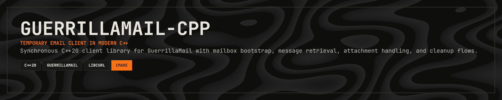

<p align="center">
  
</p>

<p align="center">
  <a href="https://en.cppreference.com/w/cpp/20"></a>
  <a href="https://cmake.org/"></a>
  <a href="https://opensource.org/licenses/MIT"></a>
  <a href="https://git.woldtech.nl/woldtech/guerrillamail-client-cpp"></a>
</p>

<p align="center">
  <a href="#status">Status</a> · <a href="#public-api">Public API</a> · <a href="#build">Build</a> · <a href="#example">Example</a> · <a href="#minimal-usage">Minimal Usage</a> · <a href="#testing">Testing</a> · <a href="#live-tests">Live Tests</a> · <a href="#notes">Notes</a> · <a href="#repository-layout">Repository Layout</a> · <a href="#project-goal">Project Goal</a>
</p>

---

`guerrillamail-cpp` is a C++20 client library for the GuerrillaMail temporary email service.

The project is being built in small vertical slices and currently supports the full first mailbox flow:

- bootstrap a GuerrillaMail session
- create a temporary email address
- list inbox messages
- fetch full message details
- list attachment metadata
- download attachment bytes
- forget an address for the current session

## Status

Current implementation choices:

- C++20
- CMake
- `vcpkg` via `third_party/vcpkg`
- `libcurl` for transport
- `nlohmann/json` for JSON parsing
- Catch2 + CTest for tests

The public API lives in:

- `include/guerrillamail/client.hpp`
- `include/guerrillamail/types.hpp`
- `include/guerrillamail/error.hpp`

## Public API

The main entry point is `guerrillamail::Client`.

Available operations:

- `Client::create(...)`
- `create_email(...)`
- `get_messages(...)`
- `fetch_email(...)`
- `list_attachments(...)`
- `fetch_attachment(...)`
- `delete_email(...)`

Key public value types:

- `ClientOptions`
- `Message`
- `EmailDetails`
- `Attachment`
- `Error`

## Build

This project expects dependencies through the bundled `vcpkg` submodule.

Example configure/build from the repository root:

```powershell
cmake -S . -B build -DCMAKE_TOOLCHAIN_FILE="third_party/vcpkg/scripts/buildsystems/vcpkg.cmake"
cmake --build build --config Debug
```

To disable optional targets:

```powershell
cmake -S . -B build ^
  -DCMAKE_TOOLCHAIN_FILE="third_party/vcpkg/scripts/buildsystems/vcpkg.cmake" ^
  -DGUERRILLAMAIL_CPP_BUILD_TESTS=OFF ^
  -DGUERRILLAMAIL_CPP_BUILD_EXAMPLES=OFF
```

## Example

The example target is defined in `examples/basic_flow.cpp`.

It mirrors the Rust demo style and demonstrates:

- client creation with optional configuration comments
- temporary address creation with a generated alias
- polling for incoming messages
- fetching full message content
- optional attachment download
- session cleanup via `delete_email(...)`

Build examples with the normal CMake build, then run:

```powershell
.\build\examples\Debug\guerrillamail-cpp-example-basic.exe
```

The example is intended as a real manual demo, not just a compile check. It will:

- create a new temporary address
- print the address so you can send mail to it
- poll for up to 2 minutes
- print message summaries and body previews
- download the first attachment of each message when present
- forget the address before exiting

## Minimal Usage

If you want the smallest possible consumer example instead of the full demo:

```cpp
#include "guerrillamail/client.hpp"

int main() {
    auto client = guerrillamail::Client::create();

    const auto email = client.create_email();
    const auto messages = client.get_messages(email);

    if (!messages.empty()) {
        const auto details = client.fetch_email(email, messages.front().mail_id);

        if (!details.attachments.empty()) {
            const auto bytes = client.fetch_attachment(email, details.mail_id, details.attachments.front());
            (void)bytes;
        }
    }

    (void)client.delete_email(email);
}
```

## Testing

Run the default automated suite:

```powershell
ctest -C Debug --output-on-failure --test-dir build
```

The test suite includes:

- unit tests for parsing and request construction
- mock-server integration tests for session reuse and API behavior
- a public-only end-to-end mock test using only public headers and the public target

## Live Tests

Live tests are opt-in.

```powershell
$env:GUERRILLAMAIL_CPP_ENABLE_LIVE_TESTS = "1"
ctest -C Debug --output-on-failure --test-dir build --tests-regex "live"
```

Current live coverage includes:

- bootstrap/token validation
- AJAX session behavior
- create/list/delete end-to-end sanity checks

Attachment download is still best validated manually when you have a real inbound email with an attachment available.

## Notes

- `ClientOptions.site` currently affects the request `site` value used by the implemented mailbox AJAX flows; attachment download intentionally does not use `site` because it targets `/inbox` instead of `ajax.php`.
- `delete_email(...)` is a session-oriented forget/cleanup operation, not a global deletion guarantee.
- Public headers do not expose `libcurl` or `nlohmann/json` types.

## Repository Layout

- `include/guerrillamail/` public headers
- `src/` library implementation
- `examples/` example program
- `tests/` unit, integration, and public-API tests
- `third_party/vcpkg/` dependency manager submodule

## Project Goal

This library is intended to stay close to the Rust reference client while still presenting a small, synchronous, idiomatic C++ surface.

## Support

If this crate saves you time or helps your work, support is appreciated:

[](https://ko-fi.com/11philip22)

## License

This project is licensed under the MIT License; see the [license](https://opensource.org/licenses/MIT) for details.